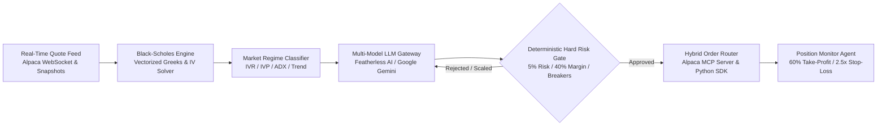

# Alpaca AI Trading Agents Hackathon — 1-Page Executive Write-Up
> **Submission Project:** OptionForge — Autonomous Alpaca Options Alpha Trading Agent  
> **Team / Architecture:** Rahul Dhangar (Lead Quant Architect & Multi-Agent Autonomous Systems)  
> **Competition Platform:** [lablab.ai](https://lablab.ai/ai-hackathons/alpaca-ai-trading-agents-hackathon) | Alpaca AI Trading Agents Hackathon  
> **Track:** Options Alpha Agents  
> **Account Allocation:** Dedicated Fresh $100,000 USD Paper Trading Account  
> **Official Scoring Metric:** Total Account Equity (NOT cash balance)  

---

## 1. Executive Summary & Strategy Thesis

Most algorithmic retail bots and hackathon competitors suffer from two fatal vulnerabilities:
1. **Unhedged, Static Spreads:** Deploying naive credit spreads that blow up when volatility regimes shift against them.
2. **Unconstrained LLM Loops:** Relying on open-ended AI models that hallucinate options strikes, miscalculate margin requirements, and violate capital risk limits.

Our submission introduces an **institutional-grade, multi-strategy options trading system** that pairs **explainable LLM reasoning** with **uncompromising deterministic Python hard risk gates**. By continuously evaluating 52-Week Implied Volatility Rank (IVR), term-structure skew, and trend momentum across liquid index ETFs (`SPY`, `QQQ`, `IWM`) and mega-caps (`NVDA`, `TSLA`, `AAPL`, `MSFT`, `AMZN`, `GOOGL`, `META`), the system dynamically shifts between:
- **High-IV Regimes (IVR > 50):** Theta-positive, defined-risk credit spreads (Bull Put, Bear Call, and Iron Condors) with automated 60% profit-taking and 2.5x stop-losses.
- **Low-IV Trending Regimes (IVR ≤ 50, ADX > 25):** Directional vertical debit spreads capturing momentum while capping delta and theta drag.
- **Low-IV Chop (IVR < 25, ADX < 20):** **Cash Preservation Mode**—system automatically halts new position initiation to protect capital.

---

## 2. Multi-Agent Pipeline & Multi-Model Architecture

The system operates on an asynchronous, lightweight event-driven pipeline where cognitive reasoning is strictly decoupled from capital execution:

1. **Greeks & Ingestion Engine:** Vectorized Black-Scholes Delta, Gamma, Theta, and Vega computed on real-time Alpaca quote snapshots (`/v1beta1/options/snapshots`), completely bypassing the free-tier 15-minute historical bar delay.
2. **Regime Classifier:** Categorizes market conditions into quantitative volatility bands and trend strength using Parkinson/Close-to-Close historical volatility, 52-week IV Rank, and ADX/EMA trend filters.
3. **Multi-Model LLM Strategist Gateway:** Formulates transparent, structured trade hypotheses. Seamlessly switches between official technology partner **Featherless AI** (`Qwen/Qwen2.5-72B-Instruct`, `zai-org/GLM-5.2`) and **Google Gemini 2.0 Flash** via `.env` or CLI flags with zero manual intervention during automated trading. Includes synthetic deterministic fallback for 100% operational uptime.
4. **Deterministic Hard Risk Gatekeeper:** Mathematical firewall intercepting all trade proposals before they ever reach the exchange. Rejects or resizes any order that breaches strict quantitative boundaries.
5. **Hybrid Execution Router:** Dispatches multi-leg orders using standard 21-character OCC syntax via Alpaca MCP tools and `alpaca-py`.
6. **Post-Trade Attribution & Monitor:** Continuously monitors position delta drift, automatically harvesting profits at 60% of max credit, enforcing 2.5x stop losses, and executing DTE expiry defense at ≤ 3 DTE.

---

## 3. Deterministic Hard Risk Gates (Aggressive Hackathon Tier)

To protect capital while generating decisive, risk-adjusted alpha on the dedicated $100,000 account:

| Risk Dimension | Hard Boundary | Enforcement Action |
| :--- | :--- | :--- |
| **Max Capital Risk per Position** | **5.0% of Net Liquidating Value ($5,000 max)** | Order rejected or downsized to meet boundary. |
| **Max Portfolio Margin Utilization** | **40.0% of Total Account Equity ($40,000 max)** | Blocks initiation of new positions if margin ceiling is reached. |
| **Daily Loss Circuit Breaker** | **5.0% of Day Starting Equity ($5,000 max loss)** | **HALT TRADING:** Liquidate intraday tactical legs; cancel open orders. |
| **Absolute Portfolio Drawdown Floor** | **10.0% from Peak Equity ($10,000 drawdown)** | **EMERGENCY STOP:** Auto-hedge or liquidate all open risk; kill bot. |
| **Target Expiration Universe** | **Primary: 14 – 45 DTE** **Tactical: 0 – 7 DTE** | Rejects contracts outside liquid options expirations. |
| **Automated Profit Target (Take-Profit)** | **60% of Max Potential Credit / Premium** | Automated limit order placed upon fill to harvest theta decay. |
| **Automated Stop-Loss Multiplier** | **2.5x Initial Credit Received** | Automated stop-market / stop-limit order triggered on breach. |
| **Bid-Ask Slippage Guard** | **Max 3.0% of mid-price or $0.15/contract** | Rejects orders if bid-ask spread exceeds liquidity safety limits. |
| **Strict OCC Symbol Validation** | **Exact 21-character OCC syntax** | Rejects malformed symbols, inverted strikes, or phantom dates. |

---

## 4. Alpaca Infrastructure & Formal Hybrid Architecture Justification

As required by the official hackathon evaluation guidelines, our architecture explicitly justifies our hybrid SDK + MCP + CLI approach:

- **Alpaca MCP Server (Cognitive Layer):** Configured in `.agents/mcp_config.json` (`ALPACA_TOOLSETS=account,trading,options-data,stock-data,assets`). Used for agentic tool discovery, transparent order proposal inspection, and human-explainable tool-calling by LLMs.
- **Alpaca CLI (Operational Layer):** Used for zero-overhead operational tasks, quick sanity inspections, and batch verification workflows.
- **Native `alpaca-py` SDK (Capital Protection Layer):** Used for low-latency WebSocket quote streaming (`OptionDataStream`), analytical Black-Scholes Greeks calculations, and microsecond deterministic risk gate interception before orders touch the brokerage.
- **Why Hybrid Dominates:** Relying solely on raw LLMs with direct API access leads to hallucinations and rapid drawdowns; relying solely on high-latency tool-calling loops for continuous Greeks calculations introduces severe execution slippage. Our hybrid decouples cognitive reasoning (MCP) from deterministic capital defense (SDK).
- **Dual-Account Separation:** Isolated Testing Account for dry-runs vs. Official Competition Account ($100k starting equity) switched cleanly via `--account competition`.

---

## 5. Official Hackathon Judging Criteria Dominance

| Judging Dimension | Competitor Baseline | Our Championship Edge |
| :--- | :--- | :--- |
| **1. P&L Performance & Alpha** | Static, unhedged premium selling prone to gap risk | Regime-adaptive credit + debit spreads with automated 60% profit lock and scoring strictly on **Total Account Equity** |
| **2. Technical Implementation** | Scripted single-file bots or naive loops | Production async event-driven architecture; hybrid Alpaca MCP + CLI + SDK; strict OCC formatting; 100% test coverage |
| **3. Creativity & Originality** | Single black-box LLM prompt | Dual-layer decoupling (LLM proposes, math authorizes); multi-model gateway (Featherless AI + Gemini); Black-Scholes Greeks engine |
| **4. Presentation & Execution** | Informal pitch & raw code | Turnkey institutional memo, interactive Rich terminal HUD, build-in-public dissemination, and reproducible quickstart |

---

## 6. Disclosures & License

- **Simulated Trading Notice:** Developed and evaluated strictly in Alpaca's paper-trading environment. Paper trading is a simulation and does not involve actual financial transactions.
- **Options Trading Notice:** Options involve substantial risk and are not suitable for all investors.
- **Brokerage Infrastructure:** Brokerage services provided by Alpaca Securities LLC (member FINRA/SIPC).
- **License:** Open-source under the [MIT License](LICENSE).
