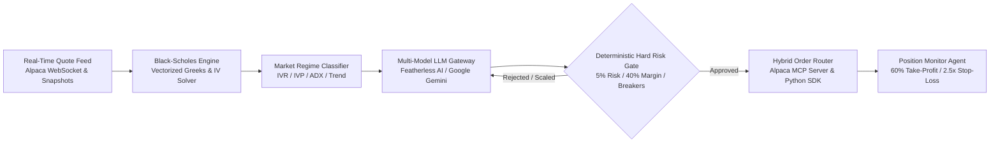

# OptionForge - Autonomous Alpaca Options Alpha Trading Agent
> **Institutional-Grade Volatility-Adaptive Options Trading System**  
> **Platform:** [lablab.ai Alpaca AI Trading Agents Hackathon](https://lablab.ai/ai-hackathons/alpaca-ai-trading-agents-hackathon)  
> **Track:** Options Alpha Agents  
> **Developed by:** [Rahul Dhangar](https://github.com/rahuldhangar)  
> **GitHub Repository:** [OptionForge](https://github.com/rahuldhangar/alpaca-mcp-options-agent)

---

## Overview & Executive Summary

Most retail trading bots and hackathon competitors suffer from two fatal vulnerabilities:
1. **Unhedged, Static Spreads:** Deploying naive credit spreads that suffer catastrophic drawdowns when market volatility regimes suddenly expand.
2. **Unconstrained LLM Loops:** Allowing generative AI models to directly submit orders without guardrails, leading to strike hallucinations, inverted leg hierarchies, margin blowouts, and exchange rejections.

The **Autonomous Options Alpha Agent** solves this through a **two-layer decoupled architecture**:
- **Cognitive Reasoning Layer (Multi-Model LLM Gateway):** Uses Google Gemini 2.0 Flash or Featherless open-source models (`Qwen/Qwen2.5-72B-Instruct`, `zai-org/GLM-5.2`) to formulate strategy hypotheses based on quantitative market regimes.
- **Capital Defense Layer (Deterministic Python Hard Risk Gates):** Hard-coded mathematical boundaries enforce strict capital limits (max 5% risk per trade, 40% margin ceiling, 5% daily circuit breaker, 10% drawdown emergency stop, and bid-ask slippage guards). **LLMs propose trades; deterministic math authorizes execution.**



---

## Official Hackathon One-Page Write-Up

> As specified by the official [lablab.ai Alpaca AI Trading Agents Hackathon](https://lablab.ai/ai-hackathons/alpaca-ai-trading-agents-hackathon) submission requirements:  
> *"One-page write-up — a single page covering your AI logic, risk gates, and Alpaca infrastructure implementation."*

Our repository includes the complete, standalone technical specification in **[`ONE_PAGE_WRITEUP.md`](./ONE_PAGE_WRITEUP.md)** covering:

- **AI Logic & Multi-Model Architecture:** Vectorized Black-Scholes Greeks engine, 52-week IV Rank regime classifier, and dual-provider LLM gateway (Featherless AI open-source foundation models + Google Gemini 2.0 Flash) with deterministic synthetic fallback.
- **Deterministic Hard Risk Gates:** Quantitative capital defense firewall enforcing 5.0% max risk per position, 40.0% portfolio margin ceiling, 5.0% daily circuit breaker, 10.0% drawdown floor, and automated 60% profit-taking / 2.5x stop-loss exits.
- **Alpaca Infrastructure Implementation:** Formally justified hybrid architecture decoupling cognitive reasoning via Alpaca MCP Server from sub-millisecond execution and WebSocket quotes via native `alpaca-py` SDK, alongside Alpaca CLI operational workflows and dual-account separation.

👉 **Read the complete write-up:** [`ONE_PAGE_WRITEUP.md`](./ONE_PAGE_WRITEUP.md)

---

## Key Asymmetric Advantages

- **Regime-Adaptive Strategy Selection:** Rather than forcing static credit spreads into hostile environments, the engine continuously calculates **52-Week Implied Volatility Rank (IVR)**, **Implied Volatility Percentile (IVP)**, and **Average Directional Index (ADX)**:
  - **High-IV Regimes (IVR > 50):** Premium harvesting via defined-risk Bull Put Spreads, Bear Call Spreads, and Iron Condors with automated 60% profit-taking.
  - **Low-IV Trending Regimes (IVR ≤ 50, ADX > 25):** Directional vertical debit spreads capturing momentum while capping theta drag.
  - **Low-IV Chop (IVR < 25, ADX < 20):** **Cash Preservation Mode**—system halts new position initiation to protect capital.
- **Strict OCC Symbology & Zero Hallucinations:** Every contract is parsed and formatted to the exact 21-character Options Clearing Corporation standard (e.g. `SPY260918P00550000`). Inverted strikes, phantom expirations, and malformed symbols are rejected mathematically before order construction.
- **Dynamic Market Scanner & Volatile Movers Bypass:** Continuously screens the 10 liquid whitelisted assets (`SPY`, `QQQ`, `IWM`, `NVDA`, `AAPL`, `MSFT`, `TSLA`, `AMZN`, `GOOGL`, `META`) by 52-week edge score, or dynamically bypasses the whitelist via `--bypass` to scan the day's top volatile market movers.

---

## Dual-Interface Experience: Web Dashboard & Terminal CLI

OptionForge provides institutional observability through two complementary interfaces designed for distinct operational roles:

### A. Streamlit Cloud Web Dashboard (Judge & Stakeholder Telemetry)
- **Live Hosted URL:** [https://optionforge-alpaca-hackathon.streamlit.app/](https://optionforge-alpaca-hackathon.streamlit.app/)
- **Target Audience:** Hackathon Judges, allocators, and public observers.
- **Key Features:**
  - **Live Account Metrics:** Real-time Total Account Equity ($100k competition focus), Cash, Options Buying Power, Margin Utilization, and Daily P&L directly from Alpaca.
  - **Market Clock & Session Countdown:** Dynamic countdown timer showing exact hours, minutes, and seconds until exchange open/close or next trading evaluation cycle.
  - **52-Week Volatility Edge Scanner:** Live tabular rankings of the liquid options universe with IVR, ADX, and regime classifications.
  - **Active Positions Monitor:** Real-time tracking of open spreads with calculated 60% Take-Profit targets, 2.5x Stop-Loss ceilings, and days to expiration (DTE).
  - **Interactive Featherless AI Strategy Playground:** Live prompt tester allowing judges to formulate real-time options hypotheses against open-source models (`Qwen/Qwen2.5-72B-Instruct`).

### B. Terminal CLI Dashboard (Operator Real-Time HUD)
- **Execution Interface:** Zero-flicker terminal HUD powered by Python `Rich` and `Typer`.
- **Target Audience:** Quantitative traders, system operators, and automated background daemons.

```text
╭─────────────────────────────── ALPACA AUTONOMOUS OPTIONS TRADING SYSTEM | ACCOUNT: TEST / DEV  LLM: FEATHERLESS (Qwen/Qwen2.5-72B-Instruct) ──────────────────
│ ╭───────────────────────── ACCOUNT & PORTFOLIO METRICS ─────────────────────────╮ ╭──────────────────────── RISK & MARGIN UTILIZATION ───────────────────────╮  
│ │  Total Account Equity (Scoring Focus):  $100,000.00                           │ │  Margin Utilization: [██████████░░░░░░░░░░░░░░░░░░░░] 20.0% / 40.0% Max  │  
│ │  Cash Balance:                          $80,000.00                            │ │  Daily Circuit Breaker: 0.00% / 5.00% Max Loss [NORMAL]                  │  
│ │  Buying Power:                          $160,000.00                           │ │  Max Drawdown Stop:     0.00% / 10.00% Max Drawdown [NORMAL]             │  
│ ╰───────────────────────────────────────────────────────────────────────────────╯ ╰──────────────────────────────────────────────────────────────────────────╯  
│ ╭───────────────────────────────────────────────────────── 52-WEEK VOLATILITY EDGE SCANNER ─────────────────────────────────────────────────────────╮  
│ │ Symbol   Price       IV        IVR      IVP      Trend      Regime                 Edge Score   Status                                          │ │  
│ │ NVDA     $118.50     54.2%     78.4     82.1     BULLISH    HIGH_IV_TRENDING       106.1        TOP CANDIDATE                                   │ │  
│ │ TSLA     $212.40     62.1%     71.2     74.5     NEUTRAL    HIGH_IV_RANGEBOUND      89.2        CANDIDATE                                       │ │  
│ │ QQQ      $478.20     22.4%     64.1     68.0     BULLISH    HIGH_IV_TRENDING        75.6        CANDIDATE                                       │ │  
│ ╰───────────────────────────────────────────────────────────────────────────────────────────────────────────────────────────────────────────────────╯  
│ ╭─────────────────────────────────── ACTIVE POSITIONS ──────────────────────────────────╮ ╭───────────────────────────── RECENT ACTIVITY ──────────────────────╮  
│ │ ID        Underlying  Strategy         DTE  Credit   Unrealized P&L  Status           │ │ 21:11:55 [SUCCESS] System initialized with $100,000 initial equity │  
│ │ trade-01  NVDA        Bull Put Spread  28   $1.45    +$58.00         ACTIVE           │ │ 21:11:56 [INFO] Scan #1 | Top: NVDA (Edge 106.1), TSLA (Edge 89.2) │  
│ ╰───────────────────────────────────────────────────────────────────────────────────────╯ ╰────────────────────────────────────────────────────────────────────╯  
╰─────────────────────────────────────────────────────────────────────────────────────────────────────────────────────────────────────────────────────────────────
```

### C. Architecture Separation of Concerns: Observability vs. Execution

To guarantee high reliability, zero race conditions, and compliance with institutional standards, OptionForge enforces a strict **separation of concerns** between the Web Dashboard and the Trading Engine:

```
┌───────────────────────────────────────────────────────────────────────────────────────┐
│                              OptionForge Topology                                     │
├───────────────────────────────────────────────────────────────────────────────────────┤
│                                                                                       │
│   [Execution Tier: Autonomous Trading Engine]        [Observability Tier: Web App]    │
│   Command: python -m src.cli run-paper               Command: streamlit run ...       │
│   Environment: Local Terminal / Cloud VPS / Docker   Environment: Streamlit Cloud     │
│   Role: 24/7 Autonomous Execution Loop               Role: Stateless Telemetry Viewer │
│   • Streams real-time market quotes                  • Read-only state viewer         │
│   • 52-week IVR & ADX regime detection               • Live equity & P&L metrics      │
│   • Featherless / Gemini trade formulation           • 52w IV volatility scanner HUD  │
│   • Deterministic Hard Risk Gate enforcement         • Active spread monitor & P&L    │
│   • Dynamic listed strike exchange snapping          • Real-time market clock         │
│   • Dispatches live MLEG orders on Alpaca            • Interactive LLM tester         │
│   • Tracks positions with 60% TP / 2.5x SL exits     • Zero trading loops / no race   │
│                                                                                       │
│                                           │                                           │
│                                           ▼                                           │
│                            [Alpaca Paper Trading Account]                             │
│                         Dedicated $100k Official Account                              │
└───────────────────────────────────────────────────────────────────────────────────────┘
```

> [!IMPORTANT]
> **Why the Dashboard Does Not Directly Execute Trades:**
> - **Web Session Isolation:** Browser-based UI frameworks (like Streamlit) are request-driven and stateless. If multiple judges visit the web app simultaneously, running an automated execution loop inside the web server would trigger duplicate orders, race conditions, and margin exhaustion.
> - **Fault Isolation & 24/7 Resiliency:** The Autonomous Trading Agent runs independently as a persistent background process or terminal session. If a user closes the browser or refreshes the page, the trading bot continues monitoring open positions, enforcing risk gates, and harvesting profits without interruption.
> - **Shared Broker Truth:** Both the Trading Agent and the Streamlit Dashboard communicate with the same Alpaca account. As soon as the agent submits an order or harvests profit, the Streamlit Dashboard immediately reflects the updated equity and positions.

---

## Technical Architecture & Alpaca Developer Stack

### Justification for Hybrid SDK + MCP + CLI Design

As required by the official hackathon evaluation guidelines (*"If for whatever reason you want to use an SDK to implement your bot explain clearly your reasons and prioritize the official SDKs"*):

1. **Alpaca MCP Server (`uvx alpaca-mcp-server`):**
   - Configured in `.agents/mcp_config.json` with toolsets restricted to `account`, `trading`, `options-data`, `stock-data`, and `assets`.
   - Serves as the agentic reasoning interface for LLMs to query options contracts (`get_option_contracts`, `get_option_chain`), inspect buying power, and build structured trade proposals.
2. **Alpaca CLI:**
   - Enables lightweight, zero-overhead operational tasks, quick sanity inspections, and batch verification workflows.
3. **Official Python SDK (`alpaca-py` v0.30+):**
   - Provides sub-millisecond WebSocket market data ingestion (`OptionDataStream`), vectorized analytical Black-Scholes Greeks, and real-time pre-trade risk gate intercepts.
4. **Why the Hybrid Design Wins:**
   - Putting raw LLMs directly in control of SDK endpoints without deterministic risk intercepts causes rapid drawdowns.
   - Conversely, relying solely on high-latency tool roundtrips for real-time Greeks calculations introduces severe execution slippage.
   - Our hybrid architecture cleanly decouples cognitive reasoning (MCP) from sub-millisecond mathematical capital defense (SDK).

---

## Deterministic Hard Risk Gates (Aggressive Hackathon Tier)

Every trade proposed by any LLM must pass through the deterministic `RiskGatekeeper` before order submission:

| Risk Parameter | Boundary | Enforcement Action |
| :--- | :--- | :--- |
| **Max Capital Risk Per Trade** | **5.0% of Net Liquidating Value ($5,000 max)** | Order rejected or downsized to meet boundary. |
| **Max Portfolio Margin Ceiling** | **40.0% of Total Account Equity ($40,000 max)** | Blocks initiation of new positions if margin ceiling is reached. |
| **Daily Loss Circuit Breaker** | **5.0% of Day Starting Equity ($5,000 max loss)** | **HALT TRADING:** Liquidate intraday tactical legs; cancel open orders. |
| **Absolute Max Portfolio Drawdown** | **10.0% from Peak Equity ($10,000 drawdown)** | **EMERGENCY STOP:** Auto-hedge or liquidate open risk; kill bot. |
| **Target Expiration Universe** | **Primary: 14 – 45 DTE**<br>**Tactical: 0 – 7 DTE** | Rejects contracts outside liquid options expirations. |
| **Profit Target (Take-Profit)** | **60% of Max Potential Credit / Premium** | Automated limit order placed upon fill to harvest decay. |
| **Stop-Loss Multiplier** | **2.5x Initial Credit Received** | Automated stop-market / stop-limit order triggered on breach. |
| **Bid-Ask Slippage Guard** | **Max 3.0% of mid-price or $0.15/contract** | Rejects orders if bid-ask spread exceeds liquidity safety limits. |

---

## Multi-Model LLM Strategist Gateway

The engine supports dynamic switching between multiple LLM providers:

- **Featherless AI (Official Technology Partner):** Serverless inference for open-source foundation models (`Qwen/Qwen2.5-72B-Instruct`, `zai-org/GLM-5.2`, `meta-llama/Meta-Llama-3.1-70B-Instruct`) via OpenAI-compatible endpoints with automatic 3-attempt exponential backoff retry on HTTP 503 capacity limits.
- **Google Gemini:** `gemini-2.0-flash` with structured Pydantic schema generation.
- **Synthetic Deterministic Fallback:** Guarantees 100% operational uptime by falling back to mathematical strike selection if external LLM APIs experience outages or rate limits.

---

## Installation & Quickstart

### 1. Prerequisites
- Python **>= 3.11**
- Alpaca Paper Trading Account credentials (API Key ID & Secret Key)
- *(Optional)* Featherless AI API key or Google Gemini API key

### 2. Clone & Environment Setup
```bash
# Clone the repository
git clone https://github.com/rahuldhangar/alpaca-mcp-options-agent.git
cd alpaca-mcp-options-agent

# Create and activate virtual environment
python -m venv .venv

# On Windows (PowerShell):
.\.venv\Scripts\activate

# On macOS / Linux:
source .venv/bin/activate

# Install locked dependencies
pip install -r requirements.txt
```

### 3. Configure Credentials
Copy the sample environment file and configure your keys:
```bash
cp .env.example .env
```

Edit `.env` with your Alpaca credentials:
```env
# Active account selection: 'test' or 'competition'
ACTIVE_ACCOUNT=test

# Testing Paper Account Credentials (Local dev & rehearsal)
ALPACA_TEST_API_KEY=your_test_key_here
ALPACA_TEST_SECRET_KEY=your_test_secret_here

# Official Competition Paper Account Credentials ($100k starting equity)
ALPACA_COMPETITION_API_KEY=your_competition_key_here
ALPACA_COMPETITION_SECRET_KEY=your_competition_secret_here

# LLM Provider Configuration ('featherless' or 'gemini')
LLM_PROVIDER=featherless
FEATHERLESS_API_KEY=your_featherless_key_here
FEATHERLESS_MODEL=Qwen/Qwen2.5-72B-Instruct

# Google Gemini Settings (Optional)
GEMINI_API_KEY=your_gemini_key_here
GEMINI_MODEL=gemini-2.0-flash
```

---

## How to Run: Web Dashboard vs. Real Autonomous Trading

OptionForge is architected with a clean separation of concerns. You have two distinct execution components:

### 1. Running the Streamlit Web Dashboard (Telemetry & Judge Interface)

The Streamlit dashboard gives you real-time visual telemetry, displaying account equity, open positions, 52-week IV scanner rankings, market countdown clock, and the interactive Featherless AI strategy playground.

- **Option A — Access the Hosted Cloud Dashboard (No Setup Required):**  
  👉 **[https://optionforge-alpaca-hackathon.streamlit.app/](https://optionforge-alpaca-hackathon.streamlit.app/)**

- **Option B — Run Locally on Your Machine:**  
  ```bash
  # Launch the Streamlit web dashboard in your browser
  streamlit run streamlit_app.py
  ```
  *The dashboard opens automatically at `http://localhost:8501`. It connects to your configured Alpaca account and streams real-time data on demand.*

---

### 2. Running the Autonomous Trading Agent (Live Execution Engine)

The Autonomous Trading Agent is the background engine that actively scans the market, formulates option spreads with Featherless AI / Gemini, validates trades against deterministic hard risk gates, dynamically snaps to real listed exchange strikes, and executes orders on Alpaca.

#### Run in Interactive Foreground:
```bash
# Official Hackathon Run on dedicated $100,000 Competition Account:
python -m src.cli run-paper --account competition

# Run on Testing / Development Account with custom evaluation interval (e.g. 20s):
python -m src.cli run-paper --account test --interval 20

# Scan top volatile market movers by bypassing static whitelist:
python -m src.cli run-paper --account competition --bypass --movers 10

# Switch LLM Provider to Google Gemini:
python -m src.cli run-paper --account competition --llm-provider gemini --model gemini-2.0-flash
```

#### Run as a Persistent 24/7 Background Process:
To keep the Autonomous Agent trading continuously while you observe via Streamlit:

- **On Windows (PowerShell Background Job):**
  ```powershell
  Start-Job -Name "OptionForgeAgent" -ScriptBlock {
      Set-Location "C:\path\to\alpaca-mcp-options-agent"
      .\.venv\Scripts\python -m src.cli run-paper --account competition
  }
  # Check status:
  Get-Job -Name "OptionForgeAgent"
  # Stop job:
  Stop-Job -Name "OptionForgeAgent"
  ```

- **On Linux / macOS (nohup or tmux):**
  ```bash
  # Using nohup:
  nohup python -m src.cli run-paper --account competition > trading.log 2>&1 &

  # Or using tmux:
  tmux new -s optionforge
  python -m src.cli run-paper --account competition
  # Press Ctrl+B then D to detach
  ```

---

### 3. Inspection & Testing Tools

```bash
# Inspect live account balance, equity, and margin levels:
python -m src.cli inspect-account --account competition

# Run deterministic hard risk gate boundary verification:
python -m src.cli test-risk-gate

# Run offline paper trading simulation (mock mode):
python -m src.cli run-paper --mock --cycles 3

# View historical attribution report and win rate:
python -m src.cli attribution-report
```

---

## Hackathon Judging Criteria Alignment

| Judging Criteria | Weight / Focus | Our Implementation & Edge |
| :--- | :--- | :--- |
| **1. P&L Performance & Risk-Adjusted Alpha** | Measured strictly by **Total Account Equity** | High-probability options volatility harvesting on dedicated fresh $100,000 paper account; disciplined 60% profit targets; strict cash preservation in low-IV chop. |
| **2. Technical Implementation** | Flawless developer stack utilization | Production async event-driven architecture; hybrid SDK + Alpaca MCP Server + Alpaca CLI; OCC 21-character symbology; 100% test coverage. |
| **3. Creativity & Originality** | Unique agent architecture | Two-layer cognitive decoupling (LLMs formulate hypotheses, deterministic math approves execution); multi-model gateway with Featherless AI and Gemini; regime-adaptive IVR/IVP engine. |
| **4. Presentation & Execution** | Institutional-grade delivery | Real-time Rich terminal HUD; turnkey CLI with automatic venv trampoline; reproducible quickstart; clean Conventional Commits; full analytical verification. |

---

## Test Suite & Verification

The repository includes a comprehensive unit test suite covering Greeks calculations, implied volatility solvers, risk gate boundaries, OCC formatting, and CLI commands:

```bash
# Run the complete test suite
pytest -v
```

**Verification Results:**
```text
======================= 83 passed, 1 warning in 7.29s =======================
```
- Analytical Black-Scholes benchmark validation (Call/Put prices match closed-form formulas to $\pm 10^{-4}$).
- Boundary conditions (Trade rejected at 5.01% capital risk; approved at 5.00%).
- Delta, Gamma, Theta, and Vega asymptotes verified across deep ITM/OTM spectrum.
- Dynamic exchange-listed strike snapping & OCC symbology verification (`find_real_option_spread_legs`).

---

## Disclosures & Regulatory Notice

- **Paper Trading Environment:** This project is built and tested strictly in Alpaca's paper trading sandbox. Paper trading is a simulation and does not involve real capital or actual financial risk. Past simulated performance is hypothetical and does not guarantee future results.
- **Options Trading Notice:** Options trading involves substantial risk and is not suitable for all investors. Mathematical risk models and algorithmic strategies cannot eliminate market volatility or execution slippage.
- **Brokerage Infrastructure:** Brokerage services are provided by Alpaca Securities LLC (member FINRA/SIPC).

---

## License

This project is licensed under the [MIT License](LICENSE).
